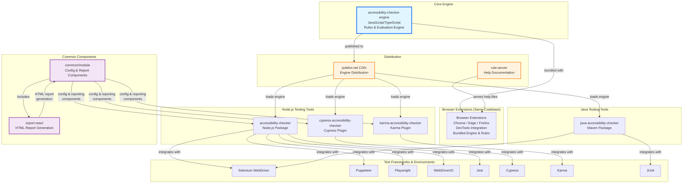
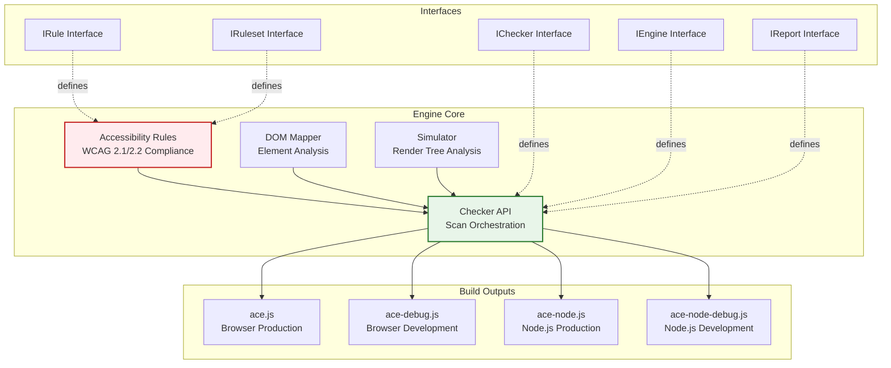
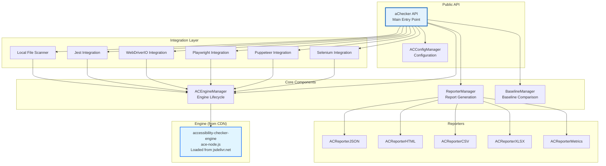
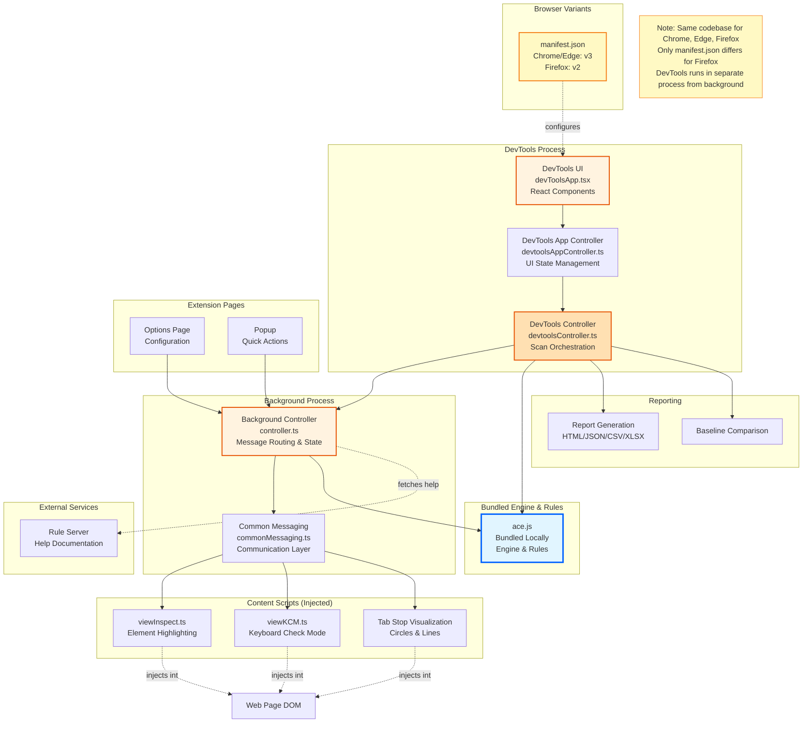
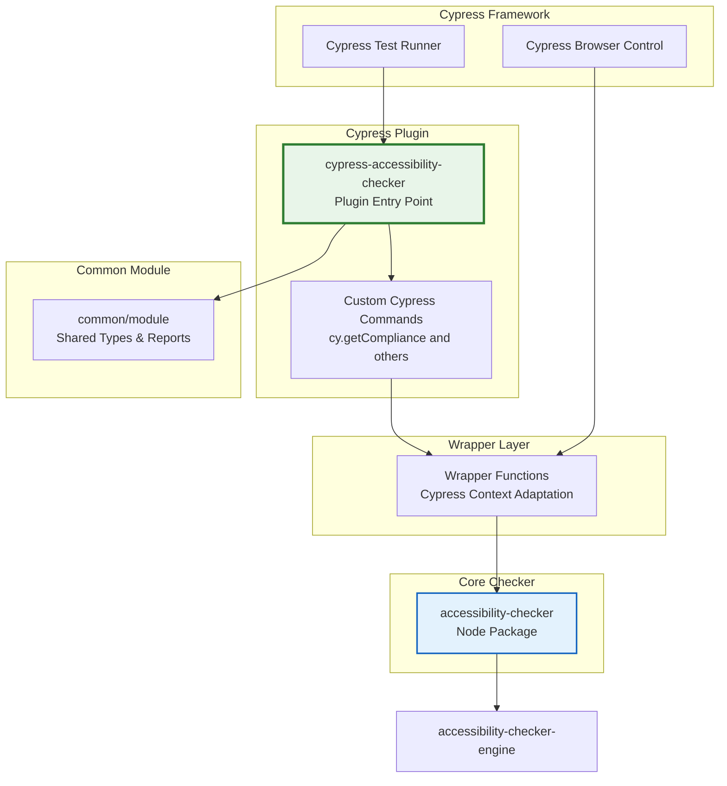
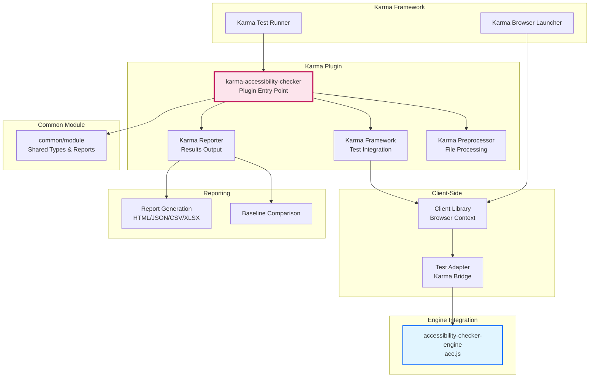
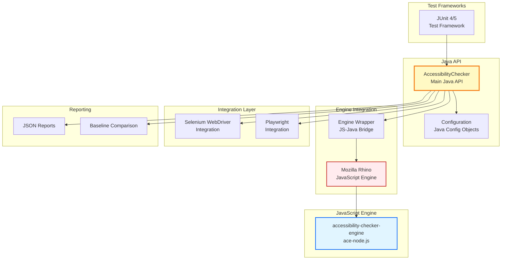
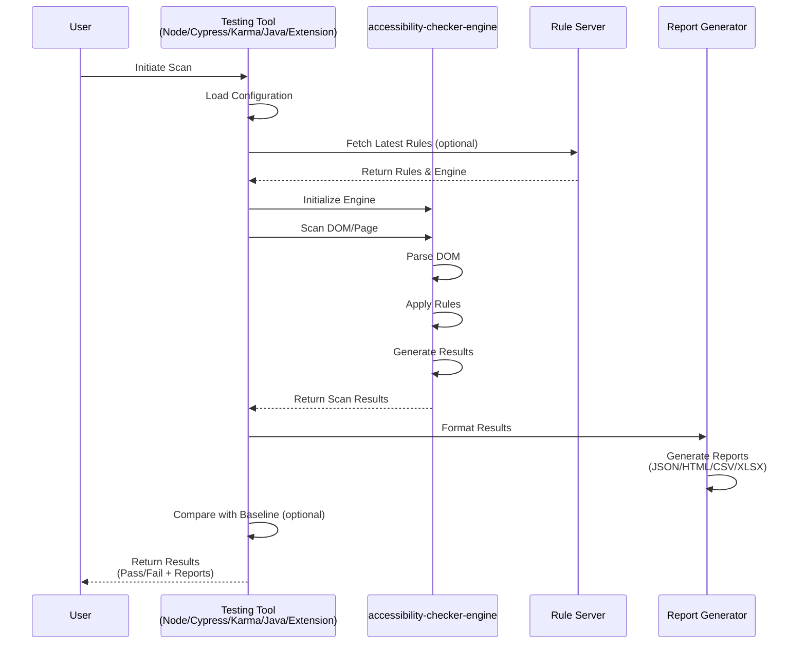
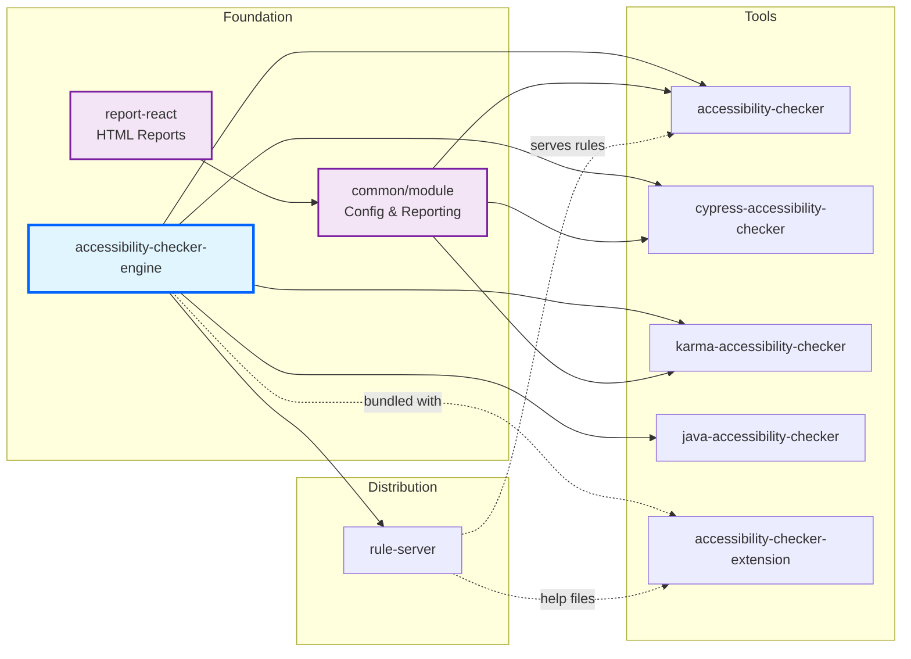

# IBM Equal Access Toolkit - Architecture Diagrams

## 1. High-Level System Architecture

## 2. accessibility-checker-engine Architecture

## 3. accessibility-checker (Node) Architecture

## 4. Browser Extension Architecture

## 5. cypress-accessibility-checker Architecture

## 6. karma-accessibility-checker Architecture

## 7. java-accessibility-checker Architecture

## 8. Data Flow: Accessibility Scan Process

## 9. Component Dependencies

## Key Architecture Principles

### 1. **Core Engine as Foundation**
- `accessibility-checker-engine` provides the core accessibility rules and evaluation logic
- Built in TypeScript/JavaScript for cross-platform compatibility
- Generates multiple build outputs for different environments (browser, Node.js)

### 2. **Modular Tool Design**
- Each tool (Node, Cypress, Karma, Java, Extension) integrates the core engine
- Tools provide environment-specific integrations and APIs
- Shared functionality extracted to `common/module`

### 3. **Common Components for Code Reuse**
- **common/module**: Shared JavaScript components for config processing and reporting
  - Configuration management (ACConfigManager)
  - Report generation (JSON, CSV, HTML, XLSX, Metrics)
  - Baseline comparison (BaselineManager)
  - Diff utilities
- **report-react**: React-based HTML report generation component
  - Built and copied into common/module during build process
  - Provides consistent HTML reporting across all tools

### 4. **Multiple Integration Points**
- **Browser Extensions**:
  - Direct DevTools integration for manual testing
  - Same codebase for Chrome, Edge, and Firefox
  - Only difference: Firefox uses separate manifest.json (v2 vs v3)
  - Engine and rules are bundled with the extension
  - Rule server only provides help documentation
- **Node.js Tools**: Integration with popular test frameworks (Jest, Selenium, Puppeteer, Playwright)
- **Cypress Plugin**: Adapted code for Cypress environment with common components
- **Karma Plugin**: Framework/reporter/preprocessor for Karma test runner
- **Java Package**: Uses Rhino JavaScript engine to run core engine in JVM

### 5. **Flexible Rule Distribution**
- **Browser Extensions**: Rules and engine bundled locally with extension
- **Node.js Tools**: Rules can be fetched from rule-server for latest updates
- Supports custom rule archives and policies

### 6. **Comprehensive Reporting**
- Multiple output formats: JSON, HTML, CSV, XLSX
- Baseline comparison for regression testing
- Metrics and summary reports
- Shared report generation via `common/module` and `report-react`

### 7. **Test Framework Agnostic**
- Node checker works with any Node-based test framework
- Provides APIs for scanning DOM, URLs, and local files
- Supports both programmatic and CLI usage

### 8. **Code Adaptation vs Wrapping**
- **Cypress**: Contains adapted/copied code from accessibility-checker, tweaked for Cypress
- **Karma**: Independent implementation with shared common components
- **Java**: Independent implementation using Rhino to execute JavaScript engine
- All tools share common components for consistency
