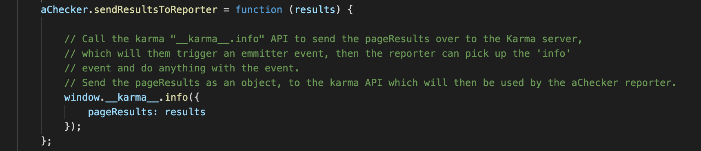

# karma-accessibility-checker

Automated accessibility testing for the Karma environment.

The deployed [Karma-accessibility-checker](https://www.npmjs.com/package/karma-accessibility-checker) package is available from NPM.

This package is a supporting component of the [IBM Equal Access Toolkit](https://ibm.com/able/toolkit).
The Toolkit provides the tools and guidance to create experiences that are delightful for people of all abilities.
The guidance is organized by phase, such as Plan, Design, Develop, and Verify, and explains how to integrate this automated testing tool into the [Verify phase](https://www.ibm.com/able/toolkit/verify/overview).
The Toolkit is a major part of the accessibility information and applications at [ibm.com/able](https://ibm.com/able/).

<!-- START doctoc generated TOC please keep comments here to allow auto update -->
<!-- DON'T EDIT THIS SECTION, INSTEAD RE-RUN doctoc TO UPDATE -->
**Table of Contents**

- [karma-accessibility-checker](#karma-accessibility-checker)
  - [Bugs and Issues](#bugs-and-issues)
  - [Requirements](#requirements)
  - [Running Locally](#running-locally)
  - [How to Debug](#how-to-debug)
  - [How to write Karma Reporter:](#how-to-write-karma-reporter)

<!-- END doctoc generated TOC please keep comment here to allow auto update -->

## Bugs and Issues

All bugs or issues related to the karma-accessibility-checker code can be created in [GitHub Issues](https://github.com/IBMa/equal-access/issues).

## Requirements

* [Node Version 18](https://nodejs.org/en/download/).

## Running Locally

To run tests locally:

1) Start the rule server:
```bash
$ cd ../rule-server
$ npm install
$ npm start
```
1) Install dependencies and start the testcase server (in `karma-accessibility-checker`):
```bash
$ npm install
$ node RuleServerLocal
```
3) Build, install, and run tests (in `karma-accessibility-checker`):
```bash
$ npm test
```

`npm test` runs three tasks, that can be run independently:
```bash
$ npm run build          # Collects files into the extension package
$ npm run installPlugin  # Installs the packaged files into the local node_modules
$ karma start            # Start Karma and runs tests
```

## How to Debug
1. Plugin:
    - Logging:
        The Karma plugin contains a full suite of logging for each of the functions created in the plugin, which makes it extremely helpful to see exactly what it is doing.
        To enable debugging simply: update the karma config "logLevel" to config.LOG_DEBUG
    - Node inspector:
        Since Karma is a node module, it can be debugged with the node inspector to see a step by step debugging, this is more heavyweight as need to debug Karma itself and then break into plugin code, and then step over from there. Steps to achieve this can be found at:  https://github.com/node-inspector/node-inspector
        Refer to: https://github.com/avajs/ava/blob/master/docs/recipes/debugging-with-vscode.md for steps on how to do a step by step debugging of all of the karma code.

2. HelperFunction:
    - Logging:
        The helper function will all contain a console.log for all critical code.
        To enable debugging simply: update the karma config "logLevel" to config.LOG_DEBUG
    - Browser Debugging:
        All helper functions are actually thrown into the browser, so you can use the browser debugger to debug this code. Use the normal steps to debug as you would when debugging rules during unit testing. The only difference is that you need to run Karma with either Firefox or Chrome, with autowatch enabled which will allow access to the browser and there will be a DEBUG option enabled.

3. Engine:
    - Logging:
        The engine contains some console.log for debugging, it can be enabled with IBMa.Config.DEBUG = true, I have binded this to the following:
        To enable debugging simply: update the karma config "logLevel" to config.LOG_DEBUG
    - Browser Debugging:
        Engine code is actually thrown into the browser, so you can use the browser debugger to debug this code. Use the normal steps to debug as you would when debugging rules during unit testing. The only difference is that you need to run Karma with either Firefox or Chrome, with autowatch enabled which will allow access to the browser and there will be a DEBUG option enabled.

4. Rules:
    - Logging:
        Add console.log in the rules, wherever you want to print items in the rules.
    - Browser Debugging:
        Since the rules are loaded into the browser, the rules can actually be debugged directly in the browsers debugged as ace.js is just loaded as a script in the browser. Use the normal steps to debug as you would when debugging rules during unit testing. The only difference is that you need to run Karma with either Firefox or Chrome, with autowatch enabled which will allow access to the browser and there will be a DEBUG option enabled.


## How to write Karma Reporter:

Reporters are Karma Plugins, and in order for the reporter to work it must be added to the list of reporters in the Karma config file of your test: e.g reporters: ['progress', 'aChecker'],

The constructor takes in several arguments:
```var ACReporter = function (baseReporterDecorator, config, logger, emitter) ```

**baseReporterDecorator**: a function that takes an object and adds to it methods and properties of karma’s basic reporter (following the Decorator pattern).

**config**: The properties from Karma’s config.

**logger**: karma’s logger

**emitter**: The emitter needs to be included as an argument if the reporter needs to receive information from the test. In ACReporter it is used so scan results can be saved to files.

The ```window.__karma__.info(object)``` function in ACHelper.js allows variables to be passed to the reporter, otherwise, results passed back would only contain information about the test, and not include other information such as the information we want to write to the report.



In order to build on the basic reporter, we need to call the baseReporterDecorator to build on top of the basic methods and properties.
```baseReporterDecorator(this);```

Other functions in ACReporter are triggered at different times, and you can edit them according to what you are trying to accomplish.

**this.onRunStart**: triggered when browsers are ready and execution starts

**this.onBrowserComplete**: triggered when tests are finished running on a browser when the browser disconnects or timeouts

**this.onSpecComplete**: triggered when getting a result from a test(spec)

**this.specSuccess**: triggered when base reporter’s onSpecComplete was called

**this.onRunComplete**: triggered when tests are finished running on all browsers

At the end of the file, the constructor baseReporterDecorator, config, and other variables must be injected because the plugins are connected to Karma using dependency injection.

```ACReporter.$inject = ['baseReporterDecorator', 'config', 'logger', 'emitter'];```

And we must also export this function, which will be called when Karma loads the reporter

```module.exports = ACReporter;```
